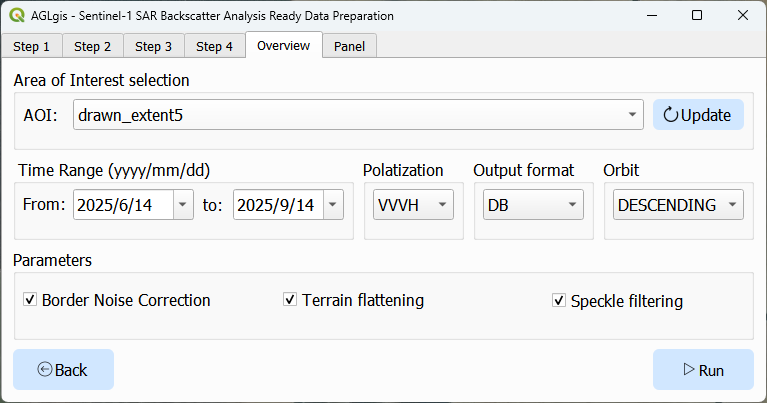
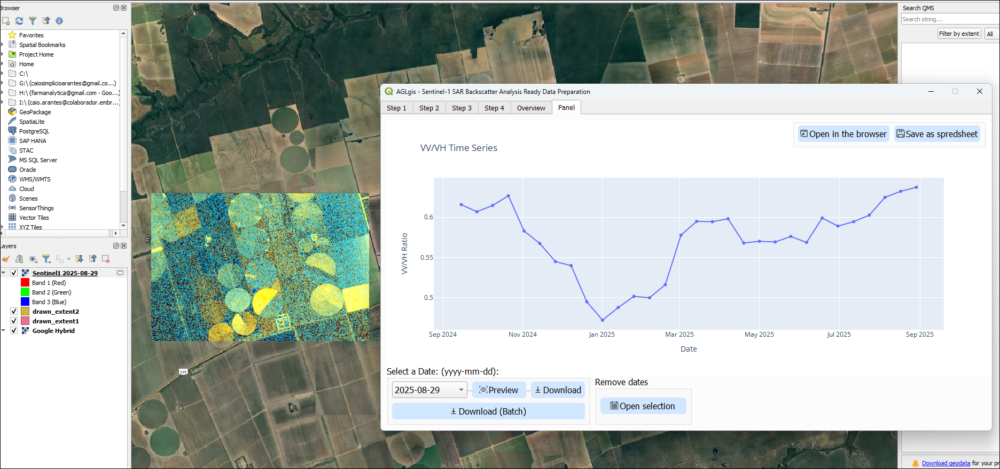

---
authors:
  - name: Caio Simplicio Arantes
    orcid: 0009-0006-6926-9368
    affiliation: 1
  - name: Mateus Pinto da Silva
    orcid: 0000-0001-8940-2716
    affiliation: 2
  - name: Sabrina Paes Leme Passos Correa
    orcid: 0000-0002-9956-4134
    affiliation: 2
  - name: Hugo Neves de Oliveira
    orcid: 0000-0001-8760-9801
    affiliation: 2
tags:
  - remote sensing
  - SAR
  - Sentinel-1
  - QGIS
  - Google Earth Engine
affiliations:
  - name: State University of Campinas (UNICAMP)
    index: 1
  - name: Universidade Federal de Viçosa (UFV)
    index: 2
bibliography: paper.bib
date: 17 September 2025
title: "AGLgis: A QGIS Plugin for Accessing and Visualizing Processed Sentinel-1 SAR Data"
---
# Summary

AGLgis is an open-source QGIS plugin [@qgis] designed to simplify the processing and analysis of Sentinel-1 Synthetic Aperture Radar (SAR) Backscatter data [@esa_sentinel1] using Google Earth Engine (GEE) [@earthengine]. The plugin provides a graphical interface for configuring and running the [ee-s1-ard](https://pypi.org/project/ee-s1-ard/) package [@ees1ard], which implements the data processing workflow described by Mullissa et al. (2021) [@mullissa2021], enabling users to process SAR data without writing code. Key features include area selection, date range configuration, border noise correction, terrain flattening, speckle filtering, and export of analysis-ready results. AGLgis aims to make advanced SAR data workflows accessible to a broader geospatial community, supporting research and operational applications in remote sensing.

# Statement of Need

Remote sensing is the acquisition of information about the Earth's surface through sensors mounted on airborne or spaceborne platforms, without direct physical contact with the observed area [@surveypreprint], having its useful use both for visualization and for training autonomous models [@cropclassification]. Being cloud prone, one of the most interesting data types is SAR, which requires pre-processing. Pre-processing SAR data may require multiple processing steps and familiarity with tools like Google Earth Engine's Code Editor[@earthengine], which can be a barrier for users without programming experience. AGLgis bridges this gap by integrating the [ee-s1-ard](https://pypi.org/project/ee-s1-ard/) package into QGIS [@qgis], offering a graphical interface that enables non-programmers and researchers to access SAR processing workflows. This approach streamlines data pre-processing, lowers the barrier to entry, and supports reproducible research in geospatial science.

# Features and Demonstration

The main capabilities and results include:

- Selection of area of interest and date range
- Automated border noise correction, terrain flattening, and speckle filtering
- RGB composites within QGIS, where the red, green, and blue channels are mapped respectively as:
  - **VV**: vertical transmit, vertical receive polarization
  - **VH**: vertical transmit, horizontal receive polarization
  - **VV/VH**: ratio between VV and VH backscatter values
- Interactive visualization of VV/VH time series
- Direct and batch download of processed bands clipped to area of interest

All major processing parameters such as geometry, temporal range, polarization, and correction options are accessible via the plugin's interface. The figures below illustrate the plugin's interface and typical results.

# Implementation

AGLgis is implemented in Python and leverages QGIS's PyQt framework for the user interface [@pyqt]. The plugin communicates with Google Earth Engine [@earthengine] (which requires authentication and a Google Cloud Project) and applies the [ee-s1-ard](https://pypi.org/project/ee-s1-ard/) package, handling data selection, and processing. 

# Availability

Users can install the plugin in QGIS through the official repository.
- Source code: [https://github.com/caioarantes/AGLgis](https://github.com/caioarantes/AGLgis)
- Documentation: Online at [GitHub Pages](https://caioarantes.github.io/AGLgis/)
- License: GNU General Public License v2 or later

# Acknowledgements

We thank the QGIS and Google Earth Engine communities for their support and open-source contributions. The authors would like to thank Serrapilheira Institute (grant R-2011-37776), Institute of Artificial and Computational Intelligence (IDATA), National Council for Scientific and Technological Development (CNPq) - process number 141203/2025-0, National Laboratory for Scientific Computing (LNCC/MCTIC) for providing HPC resources of the SDumont supercomputer, Brazilian Institute of Geography and Statistics (IBGE/MPO), and Brazilian Federal Agency for Support and Evaluation of Graduate Education (CAPES) for their support for this research.

# Reference